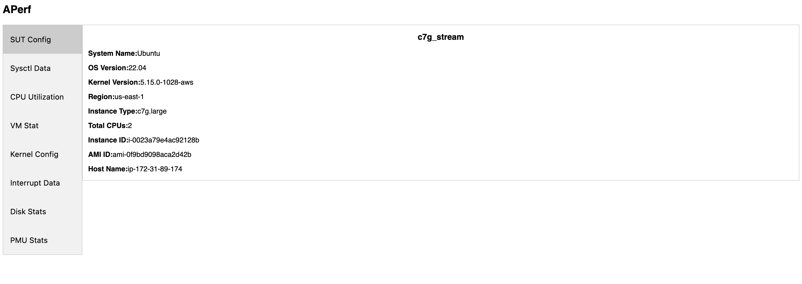
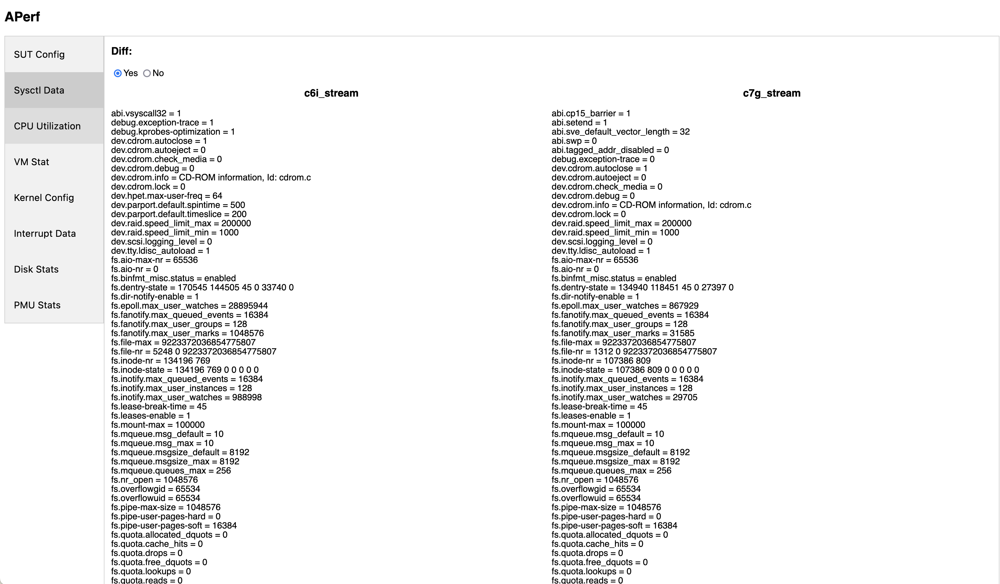
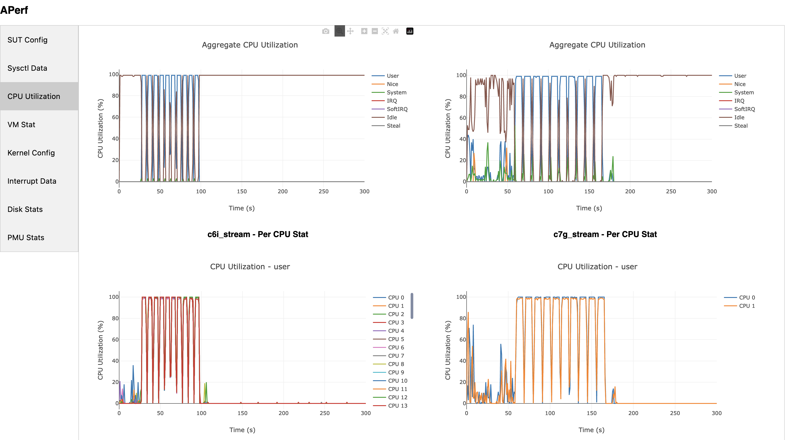
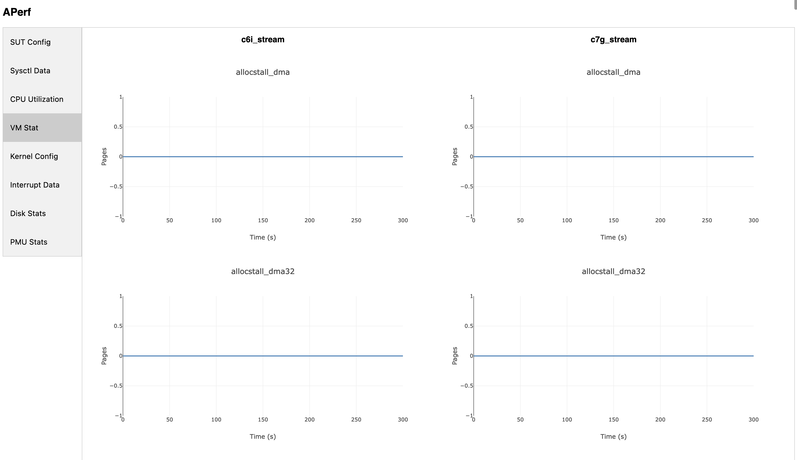
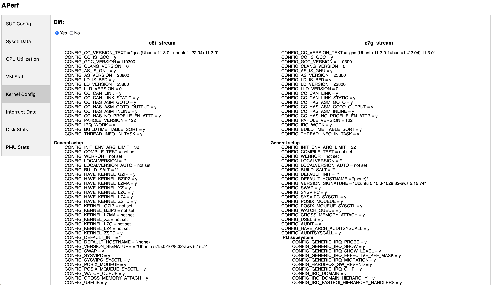
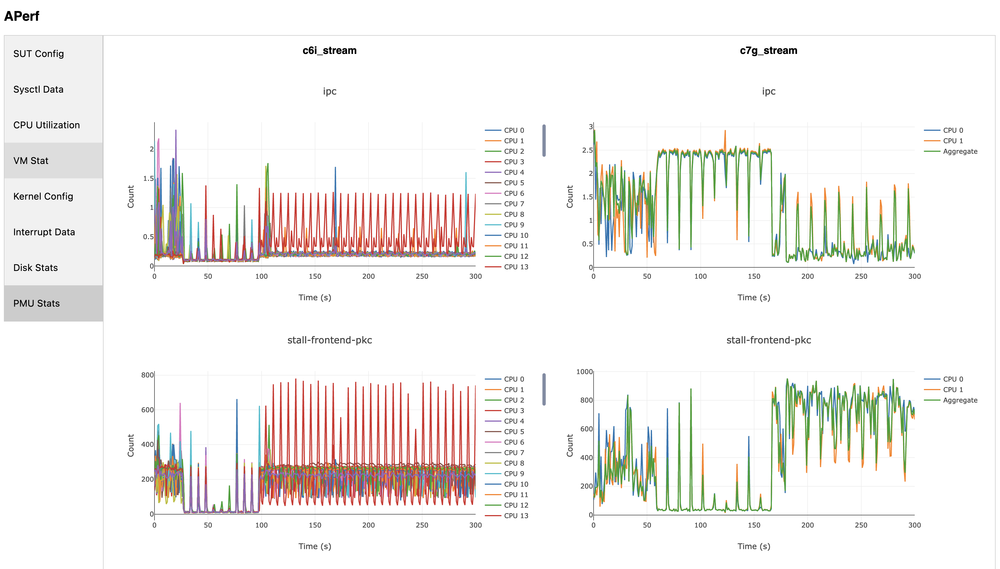

# Example
This guide will show how to run APerf to diagnose your application's performance.

## Download APerf
1. Download the binaries from the [Releases](https://github.com/aws/APerf/releases) page.
2. Copy the binaries to the host that is running your application.
3. Untar the directory, and place the binary you want it to reside.
```
tar -xvf ./aperf-v0.1.4-alpha-aarch64.tar.gz
```

## Running APerf
For the purpose of this example we will be collecting data on two systems. The first system will be an x86-based C6i system and the second one will be an AWS Graviton C7g instance. To collect performance data in 1 second time intervals for 10 seconds on the C6i instances, run the following command:

```
./aperf-v0.1.4-alpha-x86_64/aperf-collector -i 1 -p 10 -r c6i_performance_run_1
```

To collect performance data in 1 second time intervals for 10 seconds on the C7g instances, run the following command (note the `run_name` parameter has changed. This allows us to easily differentiate between two performance runs.

```
./aperf-v0.1.4-alpha-aarch64/aperf-collector -i 1 -p 10 -r c7g_performance_run_1
```

## Visualizing The Results
The APerf Visualizer runs a webserver to visualize the results. To get started you'll need the `aperf-visualizer` binary and the performance data on the same machine. `aperf-visualizer` currently only supports Linux environments. To visualize the results of a single performance run use the following command:

```
./aperf-v0.1.4-alpha-aarch64/aperf-visualizer -p 8080 --run-directory c7g_performance_run_1
```

`aperf-visualizer` only listens for connections on localhost. If `aperf-visualizer` is running on a remote host you'll need to establish an SSH tunnel and then point a web browser to forwarded port established by the SSH tunnel. If you are running `aperf-visualizer` locally you can point your local web browser to  `127.0.0.1:8080`.

When you connect to `aperf-visualizer` with your web browser you should see a screen like the following screenshot. This web page allows you to visualize the metrics collect by `aperf-collector`.



## Comparing Two Performance Run Results
To visualize and compare the results of two different performance runs, use the following command. This can be useful for comparing differences between systems.

```
./aperf-v0.1.4-alpha-aarch64/aperf-visualizer -p 8080 --run-directory c7g_performance_run_1 --run-directory c6i_performance_run_1
```
Here are some example screenshots showing the comparison of two different performance runs on each page:

### Comparing SUT Configs

### Comparing sysctl Configs

### Comparing CPU Utilization Data 

### Comparing VM Stat Data 

### Comparing Kernel Configs

### Comparing PMU Data

